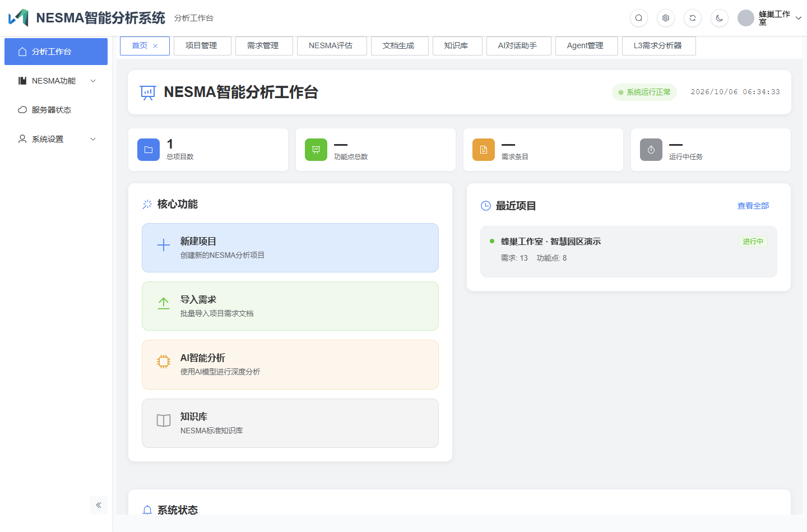

# Smart-NESMA

[中文详细说明](./README.md) · [Repository](https://github.com/coder-lulu/smart-nesma) · [License](./LICENSE) · [Notice](./NOTICE)

Smart-NESMA is a web workspace for software requirements and function-point records, maintained by 蜂巢工作室 (GitHub: [coder-lulu](https://github.com/coder-lulu)). It extends Gin-Vue-Admin with project, construction-cycle, requirement-version, L1–L4 hierarchy, evaluation-record, document, and knowledge management.

## Implemented management features

- Project, cycle, and requirement-version CRUD, including active-cycle and active-version selection.
- Hierarchical requirements, tree/table views, filtering, ordering, moving, and Excel import.
- Function-point fields for EI, EO, EQ, ILF, EIF, complexity, reuse, modification type, AFP, and UFP.
- Evaluation records and detail screens; automatic calculation still includes simulated paths.
- Document and template management, preview/download, and individual/batch generation paths.
- Knowledge-entry, rule, and case-study CRUD.
- User, role, menu, API-permission, and operation-log foundations inherited from Gin-Vue-Admin.

## Scope and limitations

AI analysis, requirement refinement, L4 generation, Mermaid generation, and chat require a configured external model where implemented. Some evaluation logic, Agent processors, workflow displays, knowledge graphs, recommendations, and fallback responses use simulated data. The sample embedding provider is `mock`; some standalone analysis tools still contain TODO actions.

This project does not claim full compliance with a particular NESMA standard version or independently measured accuracy/performance. Function boundaries, classifications, weights, adjustments, and final measurements require human review. Screenshots use separate, sanitized demo data and do not constitute end-to-end acceptance tests or evidence of successful external AI calls.

## Local development

Use Go 1.23 or newer, Node.js 18 or newer (Node.js 22 recommended for the locked tooling), pnpm, and PostgreSQL with pgvector installed and enabled in the target database. Redis is optional and disabled in the example configuration.

See the [Chinese setup guide](./README.md#本地运行) for configuration, existing Docker PostgreSQL reuse, private-backup restoration, and fresh initialization. The default frontend address is <http://127.0.0.1:8080>; the backend runs on port `8888`. A fresh installation must start with an empty `pgsql.db-name` to reach the initialization wizard. The full fresh-install workflow has not been independently tested end to end.

Business database dumps, actual business attachments, and runtime credentials are excluded from this public repository. Never restore `globals.sql` over shared PostgreSQL roles or credentials.

The [Chinese README](./README.md) includes the detailed feature matrix, two Mermaid diagrams, operating boundaries, and 16 annotated screenshots.

## License and attribution

Based on [Gin-Vue-Admin](https://github.com/flipped-aurora/gin-vue-admin), by the [flipped-aurora team](https://github.com/flipped-aurora).

**Copyright 2019 北京翻转极光科技有限责任公司**

The repository retains the upstream [Apache License 2.0 text](./LICENSE) and [NOTICE](./NOTICE). Preserve applicable license, copyright, attribution, and source-file notices when distributing the project. Third-party dependencies retain their respective licenses; this README makes no additional commercial-authorization promises.

Upstream documentation: <https://www.gin-vue-admin.com>.
